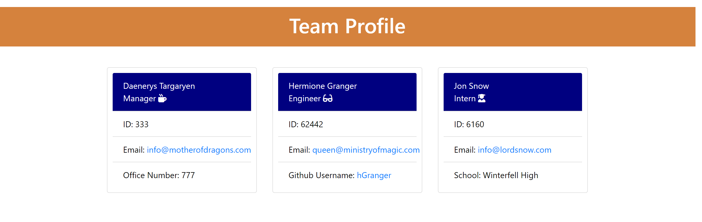
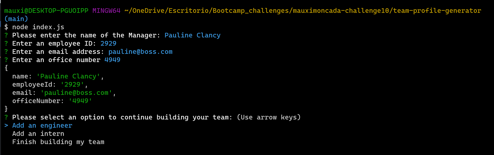
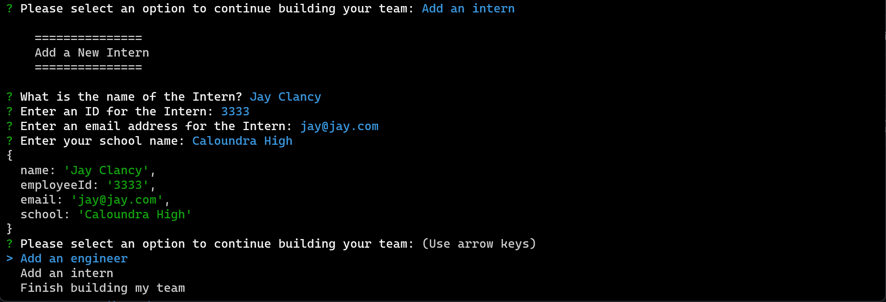
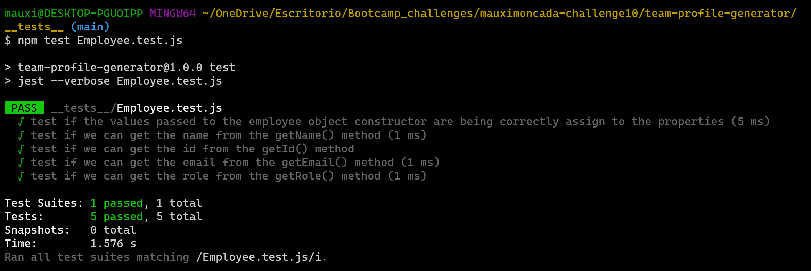

# README File Generator

## Description
The following application will help the user generate a html file containing the information for a work team.

The user will be presented with a series of questions, once the user has provided the information for each member of the team, the team information will be pushed into the html file and can be checked by the user in the browser.

-------------------

## Instructions

[Click here to watch this application in action!](https://drive.google.com/file/d/1OBZucIH8ByKLWxmQp0e90iDy84fcfmrY/view)

---------------------

## Installation

1. npm init -y
2. npm i inquirer@8.2.4
3. npm i jest

------

## Application Documentation

[Github Repo:](https://github.com/MoMoncada/team-profile-generator)
---------------------

## Application Screenshots
---------------------

### Team Profile Page Template

### Manager's prompts

### Engineer's prompts

### Intern's prompts

### Test Example

## Credits
Maria Auxiliadora Moncada 

------------

## License
N/A
